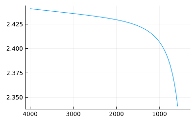

# SellmeierEqn


[](https://github.com/stakahama/SellmeierEqn.jl/actions/workflows/CI.yml?query=branch%3Amain)

This package encodes the Sellmeier equation and parameters to estimate
the refactive index of crystals. Sources:

- Ramer and Lendl,
  doi:[10.1002/9780470027318.a9287](https://doi.org/10.1002/9780470027318.a9287),
  2006.
- Weber, *Handbook of Optical Materials*, CRC Press, 2003. Chapter
  1.3.4, “Dispersion Formulas for Refractive Index”.

## Install

``` julia
using Pkg
Pkg.add(url = "https://github.com/stakahama/SellmeierEqn.jl")
```

## Example usage

``` julia
using SellmeierEqn
using Plots
```

Materials implemented so far.

``` julia
keys(MATERIAL)
```

    KeySet for a Dict{Symbol, SmParam} with 4 entries. Keys:
      :LiB3O5
      :SiO2
      :Ge
      :ZnSe

Can accept scalar or vector values for wavenumbers.

``` julia
n = refidx(1e4 / 1000, :ZnSe)
```

``` julia
ν = range(4000, 400, length=100)
n = refidx(1e4 ./ ν, :ZnSe)
plot(ν, n, xflip=true, legend=false, size=(400, 250))
```



The two below return the same value.

``` julia
refidx(ν, :ZnSe)
refidx(ν, MATERIAL[:ZnSe])
```

Therefore, users can provide their own parameters in the form of
`MATERIAL[:ZnSe]`. Additionally, a struct of type `SmFn` with a function
and wavelength bounds can be provided if the equation does not conform
to the conventional form (example further below).

When there are ordinary / extraordinary rays or optic axes defined for
the material, the function will return a tuple of vectors.

``` julia
refidx([.5, .55, .6], :SiO2)
```

    (nₒ = [1.5487545504404154, 1.5459742677791266, 1.5438181995168687], nₑ = [1.5583906451771612, 1.5555971572013598, 1.5534559791794353])

## Examples of parameter formats

(To be further populated.)

``` julia
MATERIAL[:ZnSe]
```

    SmParam(SmCoef(1.0, [4.2980149, 0.62776557, 2.8955633], [0.036888195969000004, 0.14347625806276001, 2208.4919592140245]), Bounds(0.55, 18))

``` julia
MATERIAL[:SiO2]
```

    SmParam((nₒ = SmCoef(1.0, [0.663044, 0.517852, 0.175912, 0.56538, 1.675299], [0.0036, 0.011236, 0.014160999999999998, 78.21633599999998, 430.230564]), nₑ = SmCoef(1.0, [0.665721, 0.503511, 0.214792, 0.539173, 1.807613], [0.0036, 0.011236, 0.014160999999999998, 77.299264, 39088.848681])), Bounds(0.18, 0.72))

``` julia
MATERIAL[:LiB3O5]
```

    SmParam((nx = SmFn{SellmeierEqn.var"#1#4"}(SellmeierEqn.var"#1#4"()), ny = SmFn{SellmeierEqn.var"#2#5"}(SellmeierEqn.var"#2#5"()), nz = SmFn{SellmeierEqn.var"#3#6"}(SellmeierEqn.var"#3#6"())), Bounds(0.29, 1.06))

## Related packages

- [Sellmeier.jl](https://github.com/jagot/Sellmeier.jl): clever
  implementation but form of equation is more limited
- [opticalmaterialspy](https://github.com/jtambasco/opticalmaterialspy):
  includes many relevant materials but I have not evaluated it
